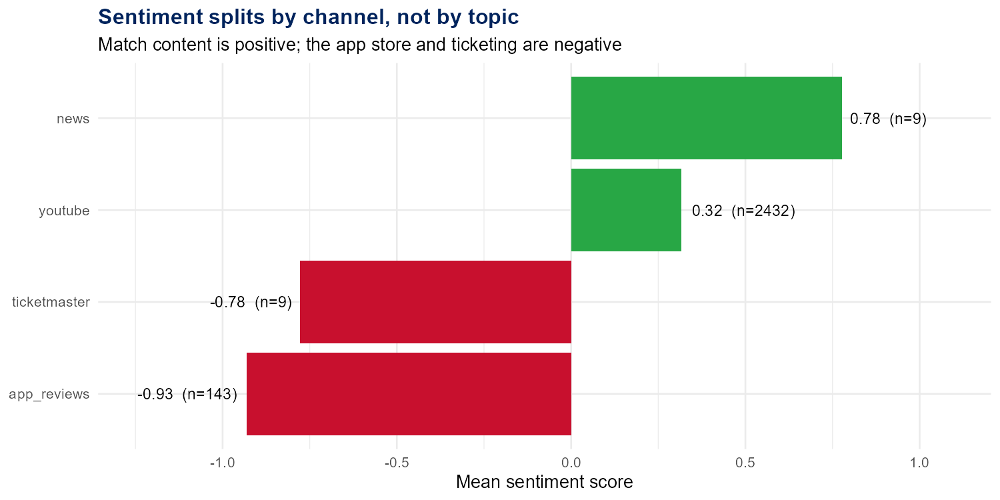
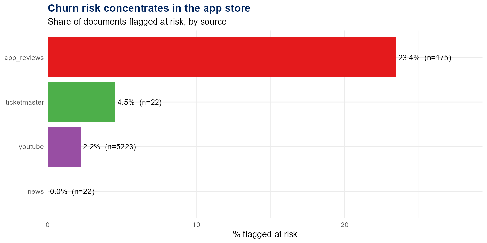
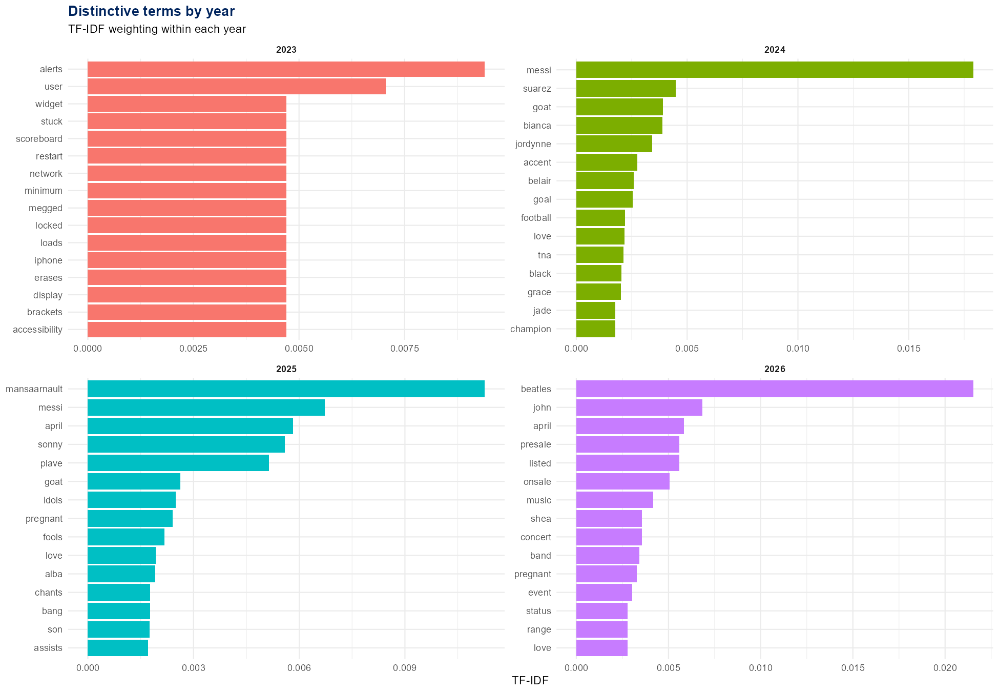
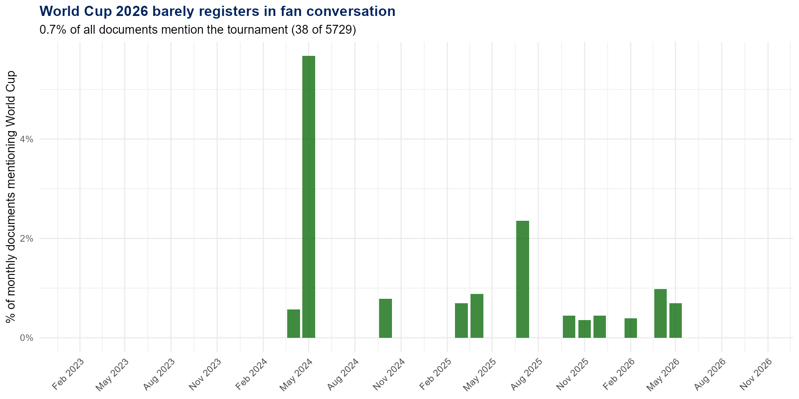
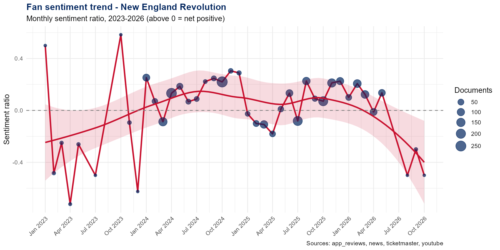
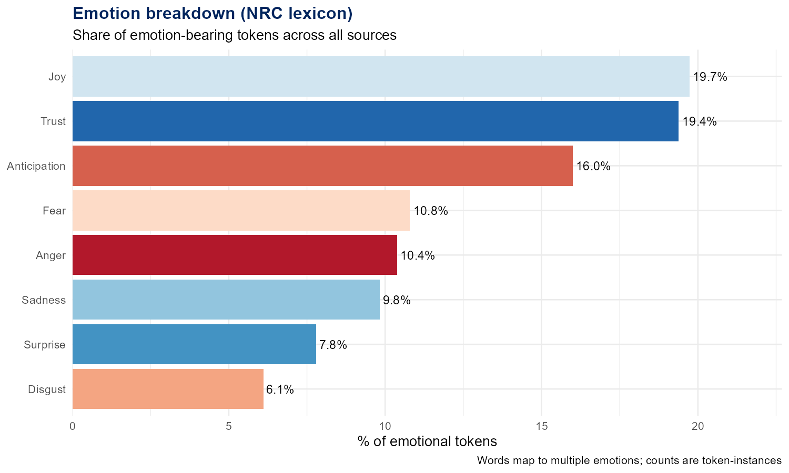
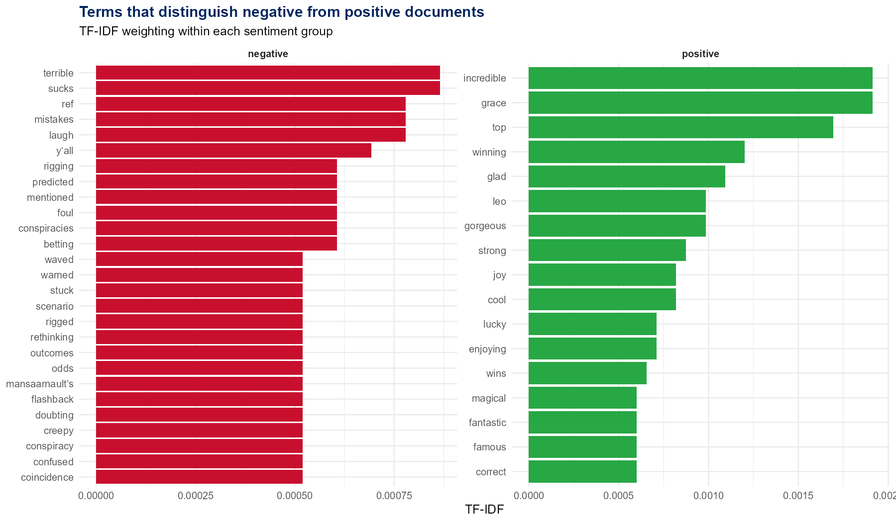
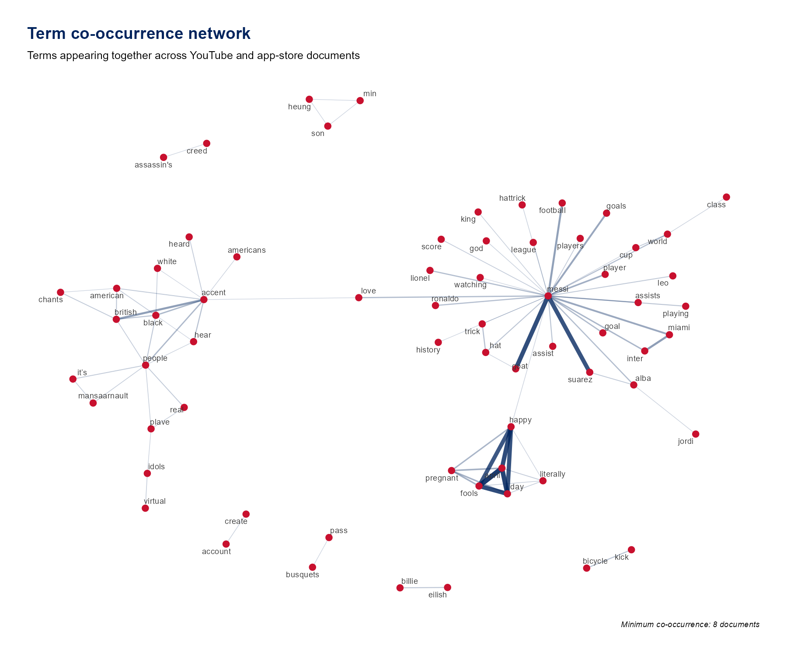
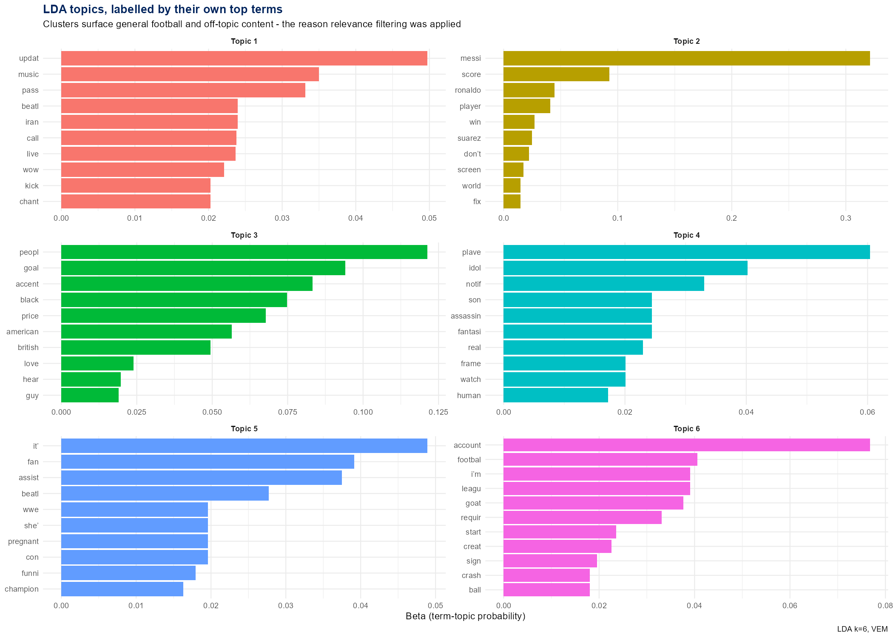

# New England Revolution — Fan Sentiment & Churn Risk Analysis

An R text-analytics pipeline built to answer two questions for the New England Revolution (MLS):
**why ticket sales were declining**, and **whether the club was positioned to benefit from the
2026 FIFA World Cup**, with Gillette Stadium confirmed as a host venue.

Applied consulting project, Hult International Business School (MGT-6080), presented to a club
representative.

Every figure below is reproducible by running `analysis/revolution_nlp_pipeline.R` against the
data in this repository.

---

## The headline finding

Sentiment does not split by *topic*. It splits by *channel*.



Fans talking about matches are positive. Fans interacting with the app store and the ticketing
platform are strongly negative. The club's problem, on this evidence, is not the product on the
pitch — it is everything that surrounds buying a ticket and using the app.

Supporting numbers, from 6,572 ingested documents:

| | Mean sentiment | % negative | n |
|---|---|---|---|
| News | +0.78 | 33.3% | 9 |
| YouTube | +0.32 | 34.7% | 2,432 |
| Ticketing | −0.78 | 77.8% | 9 |
| App store | **−0.93** | **65.0%** | 143 |

**App store mean rating: 1.7 out of 5** across 175 reviews.

---

## Churn risk concentrates in one place



A rule-based index flags documents where complaint language outweighs loyalty language. App-store
reviews are flagged at **23.4%** — an order of magnitude above match-related YouTube content at
2.2%. Whatever is driving disengagement is concentrated in the digital product, not the team.

The 2023 term profile makes the nature of the complaints unusually clear. These are the most
distinctive terms of that year, by TF-IDF:



*alerts, user, widget, stuck, restart, network, loads, iphone, erases, display, accessibility* —
an almost pure vocabulary of app failure.

---

## The World Cup assumption did not hold

The engagement began from a premise that the 2026 World Cup represented a growth opportunity the
club was positioned to capture. The data does not support it.



**38 of 5,729 documents mention the tournament — 0.7%.** Reading those 38 documents, the context
terms are *messi, ronaldo, goat, d'or, scripted* — general football debate that happens to contain
the phrase "world cup," not Boston-area fans discussing Gillette hosting matches.

One nuance worth keeping: World Cup documents average **+1.00** sentiment against **+0.25** overall.
When the tournament does come up, feeling is markedly more positive. Latent enthusiasm, near-zero
current salience.

---

## Method

| Stage | Approach |
|---|---|
| Ingestion | Multi-source CSV loader, schema normalisation, tolerant date parsing |
| Preprocessing | Tokenisation, stopword removal, handle stripping, Porter stemming |
| Sentiment | Bing lexicon (polarity) + NRC lexicon (8 emotions) |
| Topic modelling | Latent Dirichlet Allocation, k=6, VEM |
| Term weighting | TF-IDF by sentiment group and by year |
| Co-occurrence | Pairwise counts, force-directed network |
| Churn scoring | Rule-based index over complaint vs loyalty term density |

### Sentiment over time



### Emotion profile



### Distinguishing terms



### Term co-occurrence



---

## What the topic model actually showed



The LDA output is included because it is instructive, not because it produced a usable finding.
Run on the unfiltered corpus, the six clusters surface Messi and Ronaldo, a K-pop group, a WWE
storyline, and an April Fools joke — the structure genuinely present in a broad YouTube scrape.

An earlier version of this analysis assigned topic labels (*Pricing & Value*, *Digital/App
Issues*) before inspecting the output. Those labels did not match the clusters underneath them,
and any percentage attached to them would have been meaningless. Topics are now reported by their
own top terms.

The useful conclusion is methodological: the corpus needed relevance filtering before topic-level
claims could be made, and the sentiment and churn findings above rest on source-level analysis
rather than on clustering.

---

## Data

All data is **publicly available**. No club-provided or proprietary data is included.

| Source | Rows ingested | Collection |
|---|---|---|
| YouTube comments | 5,510 | Public comments on match highlight videos |
| News articles | 865 | Public RSS feeds |
| App store reviews | 175 | Public reviews |
| Ticketmaster | 22 | Public events API |
| **Total** | **6,572** | |

Author handles have been removed from the published YouTube file; the pipeline does not use them.

---

## Running it

```r
# place the four CSVs in data/, then:
source("analysis/revolution_nlp_pipeline.R")
```

Dependencies install on first run. Requires R 4.0+. Plots and `summary_metrics.csv` are written
to `plots/`.

---

## Limitations

Stated plainly, because several of these materially affect how the results should be read.

- **The corpus is dominated by one source.** YouTube contributes 5,510 of 6,572 documents. The
  ticketing and news findings rest on 9 documents each after sentiment filtering — directionally
  useful, statistically fragile. Sample sizes are printed on every chart for this reason.
- **843 of 865 news articles carry unparseable RSS dates** and are dropped by the date filter.
  Fixing that parser is the single highest-value improvement available to this analysis.
- **YouTube search queries returned substantial off-topic content.** Messi is the most frequent
  term in the corpus by a factor of three. Tighter collection queries would improve signal
  considerably.
- **Lexicon sentiment handles sports vocabulary poorly.** "Sick" and "killed it" are positive in
  this domain and negative to Bing.
- **Churn risk is a keyword index, not a validated model.** It is a prioritisation tool. No
  ground-truth churn data was available to test it against.
- **Ticketmaster rows carry scheduled fixture dates**, some in the future, which is why the date
  filter extends forward a year. The sentiment decline visible at the right edge of the trend
  chart sits on very few documents and should not be read as a trend.
- **NRC emotion counts are token-instances**, not documents; a word can map to several emotions.

---

## Author

Coovadia Nyoka — [github.com/cnyoka](https://github.com/cnyoka) ·
[linkedin.com/in/coovadia-nyoka](https://www.linkedin.com/in/coovadia-nyoka)
